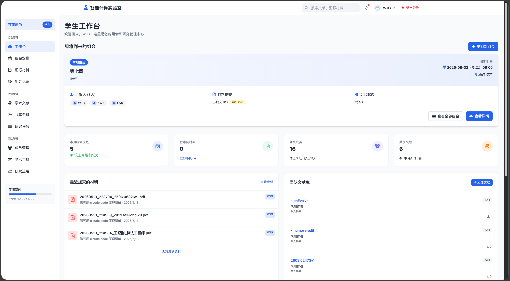
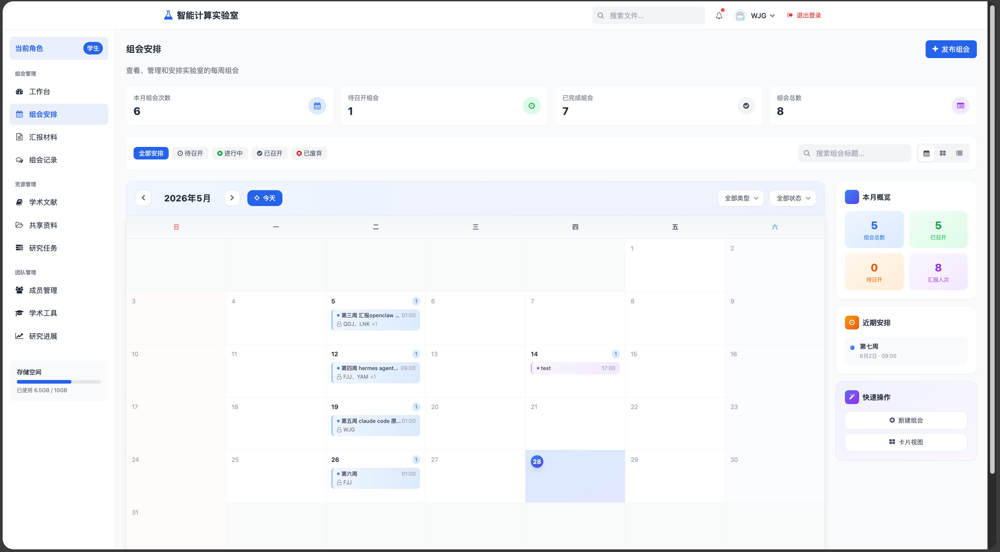
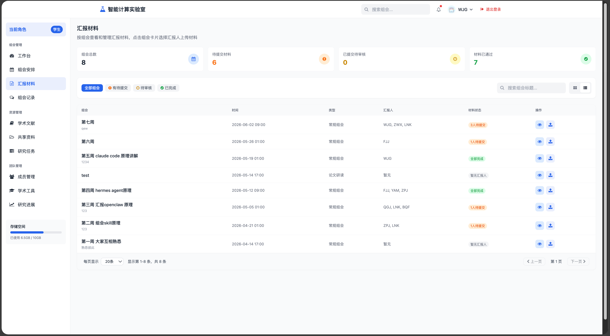
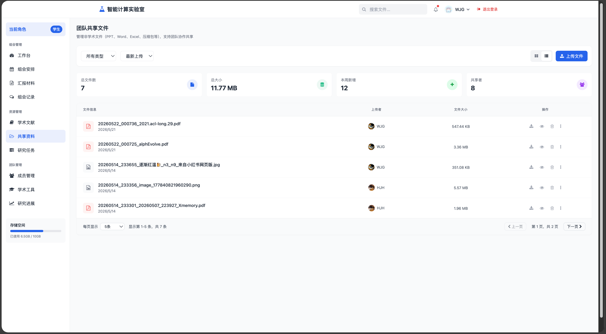

# 研究生组会管理系统

一个基于 Web 的研究生组会管理与文件共享平台，专为研究实验室设计，用于协调组会、共享研究材料和跟踪学生进度。

## 功能模块

### 用户认证
- 用户注册与登录（支持管理员/导师/学生三级角色）
- 会话管理与自动续期
- 密码修改与账户安全

### 组会管理 (gm_)
- **组会安排** - 创建组会、添加汇报人、设置时间地点、日历视图
- **汇报材料** - 材料上传、审核、参会确认
- **组会记录** - 会议纪要、讨论记录

### 资源管理 (rm_)
- **学术文献** - 团队文献库、个人文献库、收藏、阅读状态、标签分类、PDF上传
- **共享资料** - 文件上传、下载、预览、权限管理、拖拽上传
- **研究任务** - 任务分配、进度跟踪、逾期提醒

### 团队管理 (tm_)
- **成员管理** - 成员列表、角色管理、批量操作
- **研究进展** - 周期性进展提交、导师反馈、进度预警
- **学术工具** - 学术网站链接汇总、LLM模型访问、找工作资源

### 工作台
- 数据统计概览
- 即将到来的组会
- 最近提交的材料和文献

## 技术栈

| 层级 | 技术 |
|------|------|
| 后端框架 | FastAPI 0.136.3 |
| 数据库 | SQLite |
| 模板引擎 | Jinja2 3.1.6 |
| 前端样式 | Tailwind CSS |
| 图标库 | Font Awesome 4.7 |
| 数据验证 | Pydantic 2.13.4 |
| 日志管理 | Loguru 0.7.3 |
| 密码加密 | bcrypt 5.0.0 |

## 项目结构

```
group-share-project/
├── backend/                 # 后端代码
│   ├── app.py              # 应用入口
│   ├── config.py           # 配置文件
│   ├── routers/            # 路由层 - HTTP请求处理
│   │   ├── auth_router.py          # 认证路由
│   │   ├── dashboard_router.py     # 工作台路由
│   │   ├── health_router.py        # 健康检查
│   │   ├── meeting_material_router.py  # 组会材料
│   │   ├── meeting_schedule_router.py   # 组会安排
│   │   ├── member_management_router.py  # 成员管理
│   │   ├── message_system_router.py     # 消息系统
│   │   ├── page_router.py            # 页面路由
│   │   ├── paper_router.py           # 学术文献
│   │   ├── research_progress_router.py  # 研究进展
│   │   ├── research_tasks_router.py     # 研究任务
│   │   ├── shared_resources_router.py   # 共享资源
│   │   └── user_profile_router.py       # 用户资料
│   ├── services/           # 业务逻辑层
│   ├── repositories/       # 数据访问层 - CRUD操作
│   ├── models/             # 数据模型 - ORM映射
│   ├── schemas/            # 数据验证 - Pydantic模型
│   ├── dependencies/       # 依赖注入
│   │   ├── auth.py         # 认证依赖
│   │   └── pagination.py   # 分页依赖
│   ├── database/           # 数据库配置
│   ├── utils/              # 工具函数
│   └── api_docs/           # API文档
├── templates/              # HTML模板
│   ├── index.html          # 工作台
│   ├── login.html          # 登录页
│   ├── register.html       # 注册页
│   ├── user_profile.html   # 用户资料
│   ├── edit_password.html  # 修改密码
│   ├── settings.html       # 设置页
│   ├── gm_meeting_schedule.html   # 组会安排
│   ├── gm_report_materials.html   # 汇报材料
│   ├── gm_meeting_record.html     # 组会记录
│   ├── rm_paper_database.html     # 学术文献
│   ├── rm_share_file.html         # 共享资料
│   ├── rm_research_tasks.html     # 研究任务
│   ├── tm_user_management.html    # 成员管理
│   ├── tm_research_progress.html  # 研究进展
│   └── tm_academic_website.html   # 学术工具
├── uploads/                # 上传文件存储
├── docs/                   # 文档目录
├── pyproject.toml          # 项目配置
├── requirements.txt        # 依赖列表
├── Dockerfile              # Docker镜像
├── docker-compose.yml      # Docker编排
├── CLAUDE.md               # 开发规范
└── README.md               # 项目说明
```

## 快速启动

### 方式一：使用 uv (推荐)

```bash
# 安装 uv
pip install uv

# 安装依赖
uv sync

# 启动服务
cd backend
python app.py
```

### 方式二：传统 pip

```bash
# 安装依赖
pip install -r requirements.txt

# 启动服务
cd backend
python app.py
```

访问 http://localhost:8088 即可使用系统。

默认管理员账号：`admin` / `admin`

## 系统截图

### 工作台


### 组会安排


### 汇报材料


### 共享资料


### 方式三：Docker 部署

```bash
# 构建并启动
docker-compose up -d

# 查看日志
docker-compose logs -f

# 停止服务
docker-compose down
```

## API 文档

启动服务后访问：
- Swagger UI: http://localhost:8088/docs
- ReDoc: http://localhost:8088/redoc

## 环境要求

- Python 3.11+
- SQLite 3
- Docker (可选，用于容器化部署)

## 数据库表结构

系统包含以下数据表：

| 表名 | 功能 |
|------|------|
| users | 用户信息 |
| meetings | 组会信息 |
| meeting_presenters | 汇报人关联 |
| meeting_files | 组会材料 |
| research_tasks | 研究任务 |
| papers | 团队文献 |
| personal_papers | 个人文献 |
| tags | 标签 |
| paper_user_relations | 文献-用户关系 |
| paper_tags | 文献-标签关联 |
| files | 共享文件 |
| research_progress | 研究进展 |
| progress_settings | 提交周期设置 |
| messages | 消息留言 |

## 开发规范

详见 [CLAUDE.md](./CLAUDE.md)

### 分层架构
- **routers/** - 只处理 HTTP 请求和响应，不写任何业务逻辑
- **services/** - 所有业务逻辑写在这里
- **repositories/** - 只做数据库 CRUD，不写业务判断

### 命名规范
- 文件名：snake_case + 层级后缀，如 `user_service.py`
- 类名：PascalCase + 层级后缀，如 `UserService`
- 函数名：snake_case，如 `get_user_by_id`

### 开发规则
- 禁止在 router 层直接操作数据库
- 禁止在 repository 层写业务判断逻辑
- 新增模块必须同时创建三层文件

## License

MIT License