# 研究生组会管理系统

一个面向实验室研究团队的组会管理平台，支持组会安排、材料提交、文献管理、研究进展跟踪等功能。

## 系统截图

### 用户认证

| 登录 | 注册 |
|:---:|:---:|
| 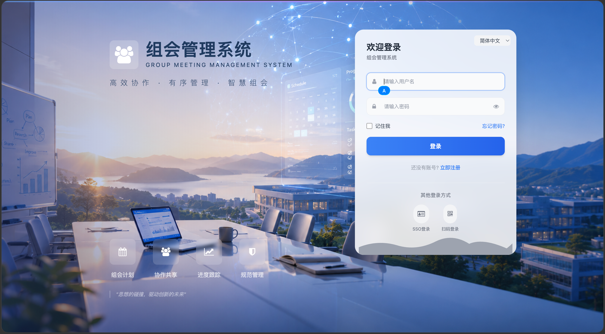 | 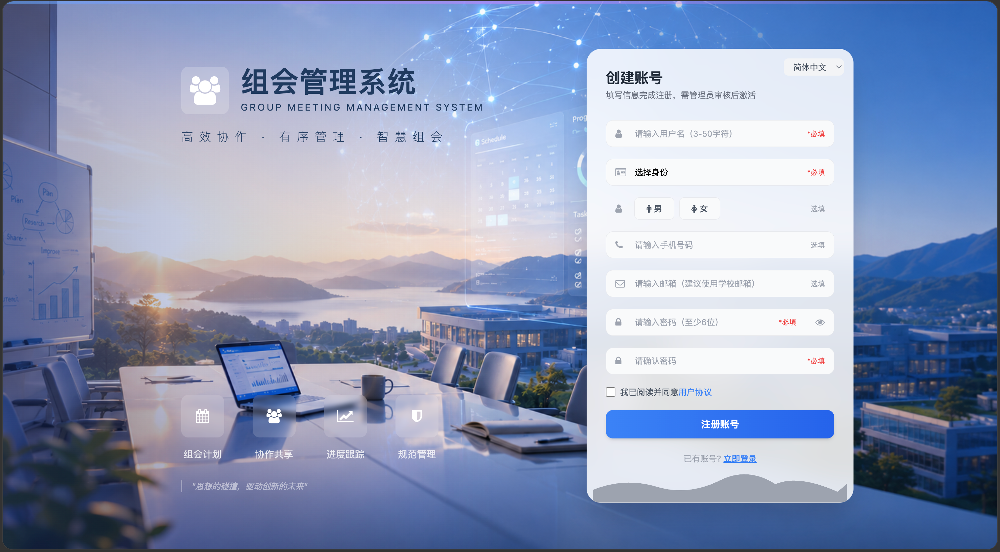 |

### 核心功能

| 工作台 | 组会安排 | 汇报材料 | 组会记录 |
|:---:|:---:|:---:|:---:|
| 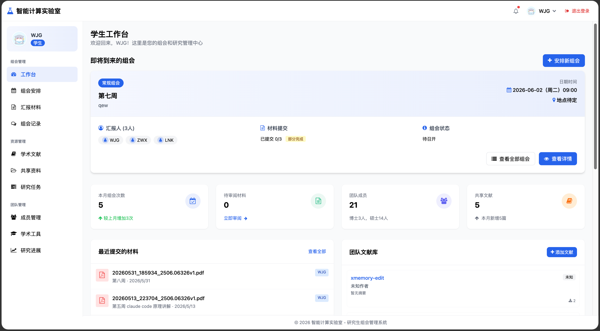 | 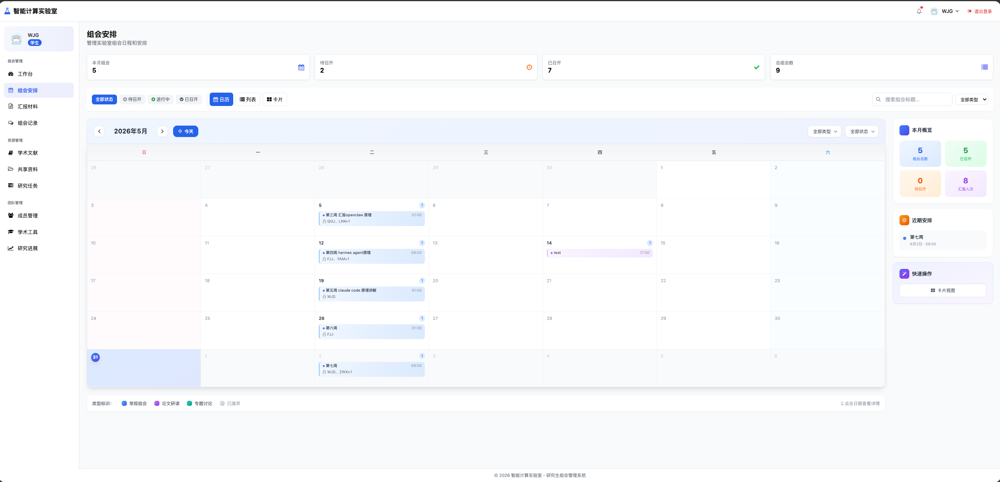 | 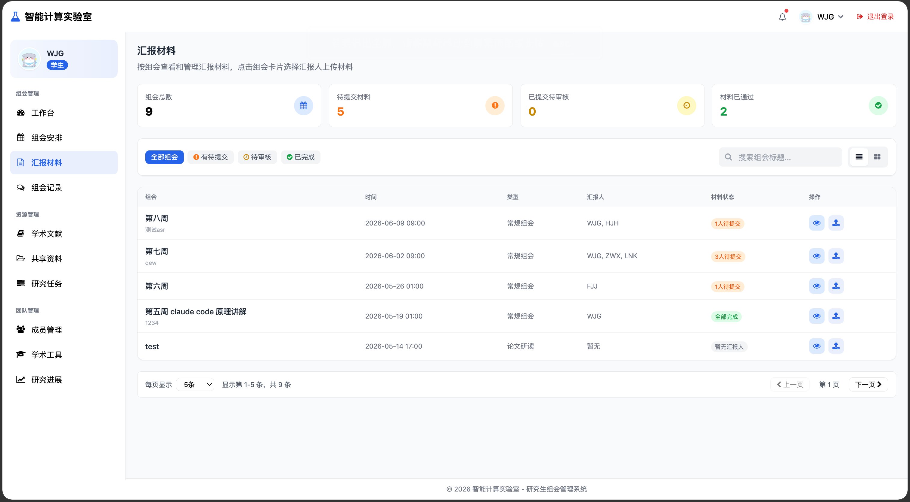 | 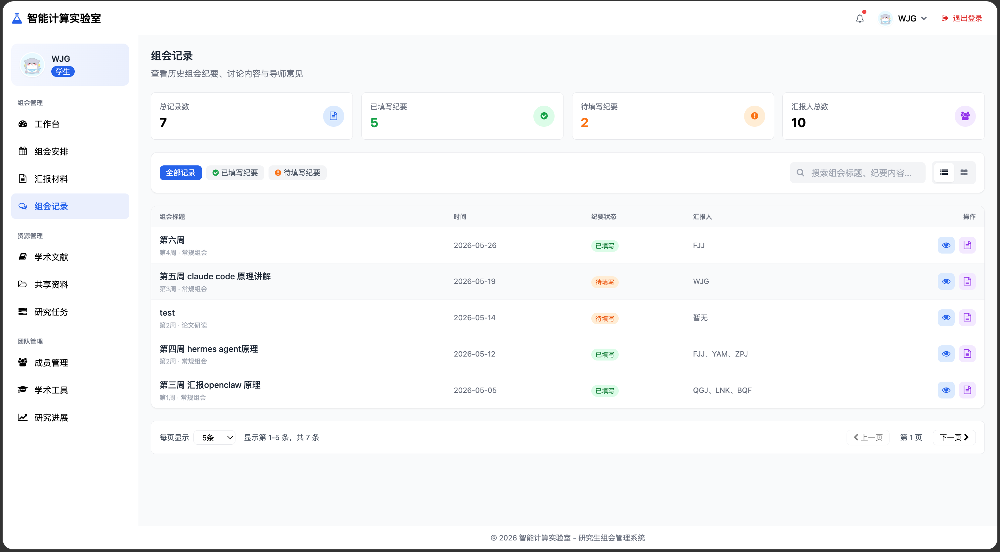 |

### 资源管理

| 学术文献 | 共享资料 | 研究任务 | 研究进展 |
|:---:|:---:|:---:|:---:|
| 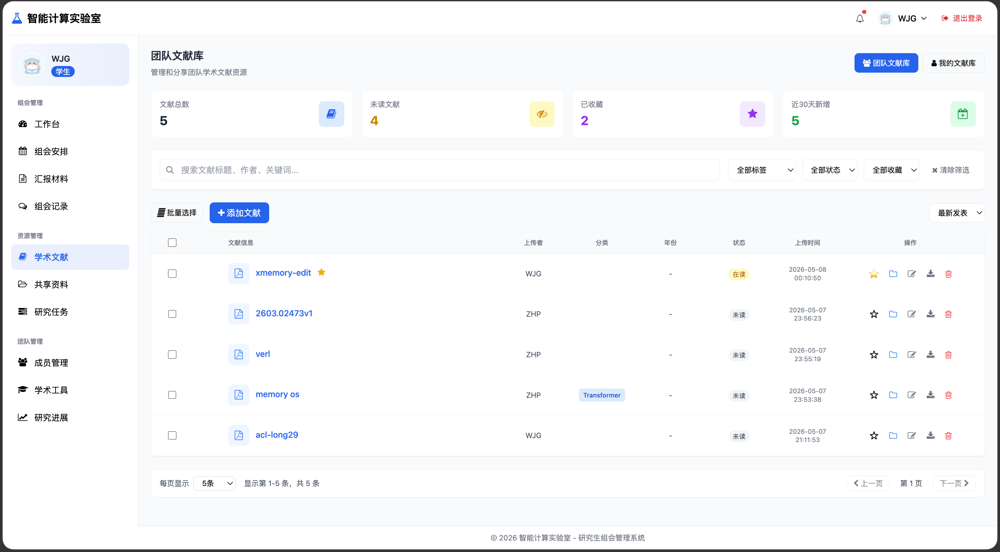 | 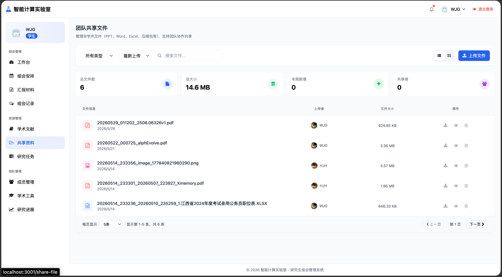 | 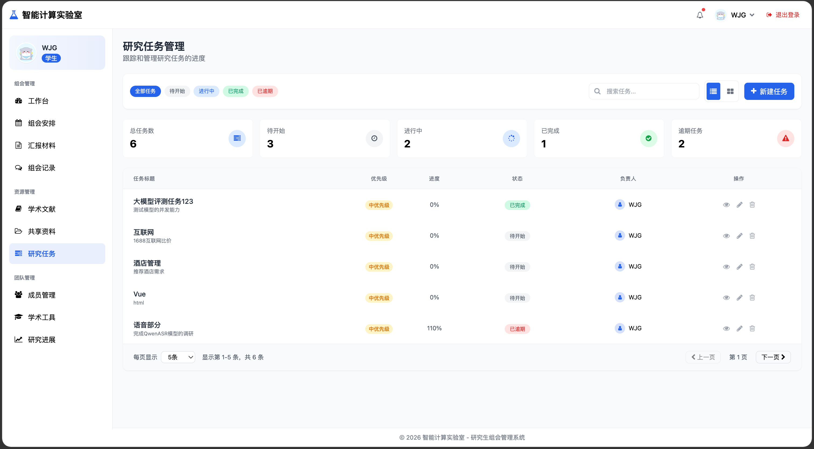 | 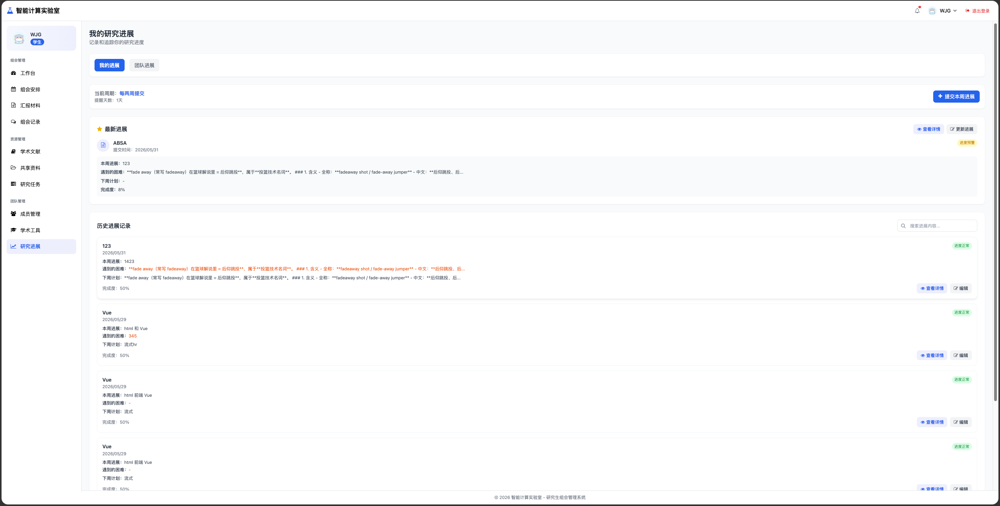 |

### 团队管理

| 成员管理 | 学术工具 |
|:---:|:---:|
| 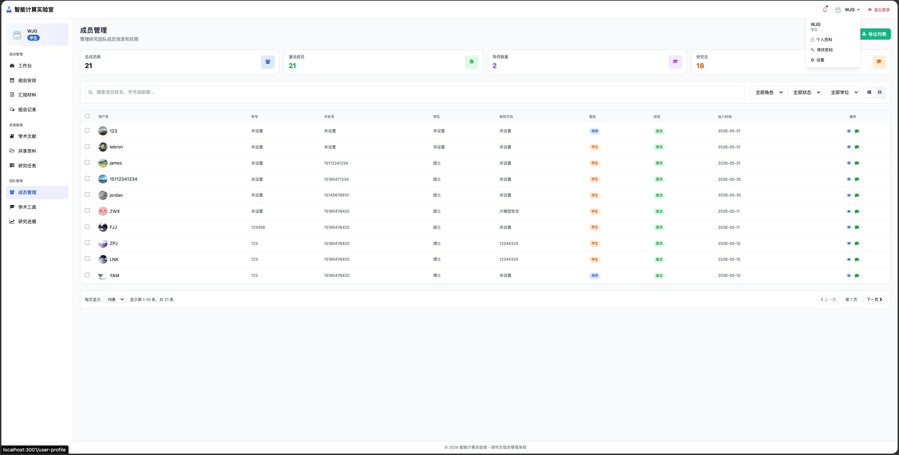 | 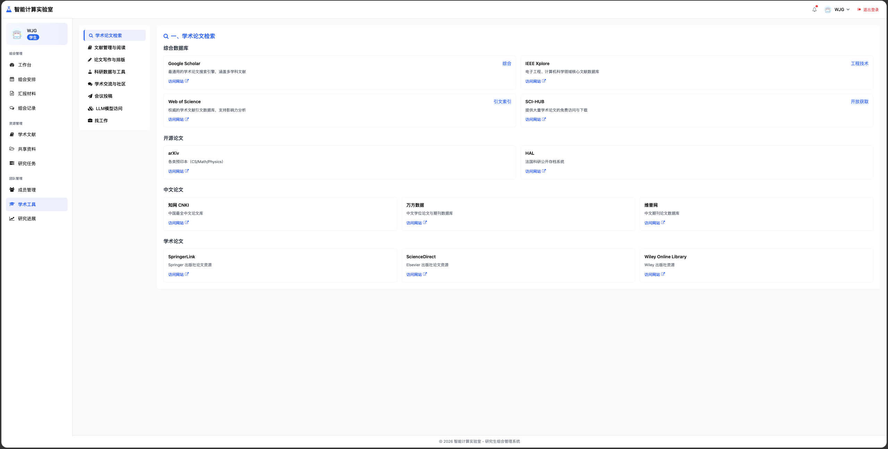 |

---

## 功能模块

### 用户认证
- 用户注册与登录（支持管理员/导师/学生三级角色）
- 会话管理与自动续期
- 密码修改与账户安全

### 组会管理
| 模块 | 功能 |
|------|------|
| **工作台** | 数据概览、即将到来的组会、最近材料、文献库、研究进展 |
| **组会安排** | 日历/列表/卡片视图、创建/编辑/删除组会、分配汇报人、材料状态跟踪 |
| **汇报材料** | 上传/管理汇报材料、材料状态跟踪、权限控制 |
| **组会记录** | 历史组会纪要、Markdown 编辑、材料查看、汇报人分组显示 |

### 资源管理
| 模块 | 功能 |
|------|------|
| **学术文献** | 团队文献库、个人文献库、文献分享、标签管理、阅读状态 |
| **共享资料** | 文件上传/下载、权限控制、文件预览、按汇报人分组显示材料 |
| **研究任务** | 任务创建/分配、进度跟踪、状态管理 |
| **研究进展** | 进展提交、导师反馈、进度统计、附件上传/删除 |

### 团队管理
| 模块 | 功能 |
|------|------|
| **成员管理** | 用户列表、角色分配、成员信息管理 |
| **学术工具** | 学术资源链接、工具推荐 |

---

## 技术栈

### 前端
| 技术 | 版本 | 说明 |
|------|------|------|
| Vue | 3.4 | 渐进式 JavaScript 框架 |
| Vue Router | 4.6 | 官方路由管理器 |
| Pinia | 2.1 | 状态管理库 |
| Tailwind CSS | 3.4 | 实用优先的 CSS 框架 |
| Vite | 5.0 | 下一代前端构建工具 |
| Axios | 1.6 | HTTP 请求库 |
| Marked | 18.0 | Markdown 解析库 |

### 后端
| 技术 | 版本 | 说明 |
|------|------|------|
| Python | 3.11 | 编程语言 |
| FastAPI | 0.136 | 现代高性能 Web 框架 |
| SQLite | 3 | 轻量级数据库 |
| Uvicorn | 0.48 | ASGI 服务器 |
| Loguru | 0.7 | 日志管理 |
| bcrypt | 5.0 | 密码加密 |
| Pydantic | 2.13 | 数据验证 |

---

## 项目结构

```
group-share-project/
├── frontend/                    # Vue 3 前端
│   ├── src/
│   │   ├── views/              # 页面组件 (15个)
│   │   ├── components/         # 公共组件 (45个)
│   │   ├── api/                # API 接口封装
│   │   ├── stores/             # Pinia 状态管理
│   │   ├── router/             # 路由配置
│   │   └── config/             # 配置文件
│   ├── package.json
│   ├── vite.config.js
│   └── tailwind.config.js
│
├── backend/                     # FastAPI 后端
│   ├── routers/                 # API 路由 (14个)
│   ├── services/                # 业务逻辑层
│   ├── repositories/            # 数据访问层
│   ├── models/                  # 数据模型
│   ├── schemas/                 # 数据验证
│   ├── dependencies/            # 依赖注入
│   ├── database/                # 数据库配置
│   └── config.py                # 应用配置
│
├── uploads/                     # 上传文件目录
│   ├── share_files/            # 共享资料
│   ├── papers/                  # 学术文献
│   ├── meeting_files/          # 组会材料
│   ├── progress_files/         # 研究进展附件
│   └── avatars/                 # 用户头像
│
├── images/                      # 系统截图
├── docs/                        # 文档目录
├── Dockerfile                   # Docker 镜像
├── docker-compose.yml           # Docker 编排
├── CLAUDE.md                    # 开发规范
└── README.md                    # 项目说明
```

---

## 快速启动

### 环境要求
- Python 3.11+
- Node.js 18+
- SQLite 3

### 后端启动

```bash
# 方式一：使用 uv (推荐)
pip install uv
uv sync

# 方式二：传统 pip
pip install -r requirements.txt

# 启动服务
cd backend
uvicorn app:app --reload --host 0.0.0.0 --port 8088
```

后端服务将在 `http://localhost:8088` 运行。

### 前端启动

```bash
cd frontend
npm install
npm run dev
```

前端开发服务将在 `http://localhost:3001` 运行。

### Docker 部署

```bash
docker-compose up -d
```

访问 `http://localhost:8088` 即可使用系统。

**默认管理员账号：** `admin` / `admin`

---

## 用户角色权限

| 角色 | 权限说明 |
|------|----------|
| **管理员 (admin)** | 全部功能、成员管理、系统设置、所有数据操作 |
| **导师 (teacher)** | 组会管理、材料审阅、进展反馈、查看所有学生数据 |
| **学生 (student)** | 材料提交、进展提交、个人文献管理、查看团队文献 |

---

## API 文档

启动后端服务后访问：
- **Swagger UI:** http://localhost:8088/docs
- **ReDoc:** http://localhost:8088/redoc

### 主要 API 端点

#### 认证 `/api/auth`
- `POST /login` - 登录
- `POST /register` - 注册
- `POST /logout` - 退出登录
- `GET /me` - 获取当前用户信息

#### 组会管理 `/api/meetings`
- `GET /` - 组会列表（支持分页、筛选）
- `POST /` - 创建组会
- `GET /{id}` - 组会详情
- `PUT /{id}` - 更新组会
- `DELETE /{id}` - 删除组会
- `GET /stats` - 统计数据
- `GET /{id}/presenters` - 汇报人列表
- `POST /{id}/presenters` - 添加汇报人

#### 汇报材料 `/api/materials`
- `GET /{presenter_id}/files` - 获取汇报人材料
- `POST /{presenter_id}/files` - 上传材料
- `GET /meeting_files/{file_id}/download` - 下载材料

#### 学术文献 `/api/paper_database`
- `GET /` - 文献列表
- `POST /` - 上传文献
- `GET /{id}` - 文献详情
- `POST /{id}/add-to-personal` - 添加到个人库
- `POST /{id}/share-to-team` - 分享到团队
- `PUT /{id}/tags` - 设置标签

#### 共享资料 `/api/files`
- `POST /upload` - 上传文件
- `GET /` - 文件列表
- `GET /{file_id}` - 文件详情
- `DELETE /{file_id}` - 删除文件
- `GET /{file_id}/download` - 下载文件

#### 研究进展 `/api/research_progress`
- `GET /my` - 我的进展列表
- `POST /submit` - 提交进展
- `GET /{id}` - 进展详情
- `PUT /{id}` - 更新进展
- `GET /team` - 团队进展
- `GET /stats` - 进展统计
- `POST /{id}/feedback` - 导师反馈

---

## 数据库表结构

| 表名 | 功能 |
|------|------|
| users | 用户信息（角色、头像、研究方向） |
| meetings | 组会信息（标题、时间、地点、状态） |
| meeting_presenters | 汇报人关联（用户、时长、材料状态） |
| meeting_files | 组会材料（文件路径、类型、大小） |
| research_tasks | 研究任务（任务名、负责人、进度） |
| papers | 团队文献（标题、作者、DOI、PDF） |
| personal_papers | 个人文献（关联团队文献） |
| tags | 标签（文献分类） |
| paper_user_relations | 文献-用户关系（收藏、阅读状态） |
| files | 共享文件（上传者、权限、哈希） |
| research_progress | 研究进展（周报、附件、反馈） |
| progress_settings | 提交周期设置（提醒天数） |
| messages | 消息留言（类型、内容） |

---

## 开发规范

详见 [CLAUDE.md](./CLAUDE.md)

### 后端分层架构
- **routers/** - 只处理 HTTP 请求和响应，不写任何业务逻辑
- **services/** - 所有业务逻辑写在这里
- **repositories/** - 只做数据库 CRUD，不写业务判断

### 前端分层架构
- **views/** - 页面组件，处理页面逻辑
- **components/** - 可复用 UI 组件
- **api/** - API 请求封装
- **stores/** - 全局状态管理

---

## 版本历史

| 版本 | 功能更新 |
|------|----------|
| v0.0.1 | 基础架构搭建、用户认证 |
| v0.0.2 | 组会管理、汇报材料 |
| v0.0.3 | 学术文献、共享资料、研究任务 |
| v0.0.4 | 研究进展、分页优化、Vue 前端重构 |

---

## 作者

wjg

## License

MIT License